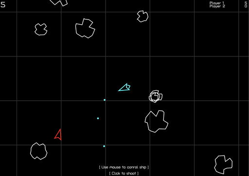

# Asteroids

    

[Live Demo](https://space-lli.rivet.game/)

|  Language | Networking | Rendering |
|  --- | --- | --- |
|  [TypeScript](https://www.typescriptlang.org) | [Socket.IO](https://socket.io) | [Canvas](https://developer.mozilla.org/en-US/docs/Web/API/Canvas_API) |

**Rivet Features**

- [♟️ Matchmaker](https://rivet.gg/docs/matchmaker)
- [🌐 Dynamic Servers](https://rivet.gg/docs/dynamic-servers)

## Running locally

1. Clone the GitHub repo
2. Open this folder
3. Run: `rivet init`
4. Run `yarn start`
